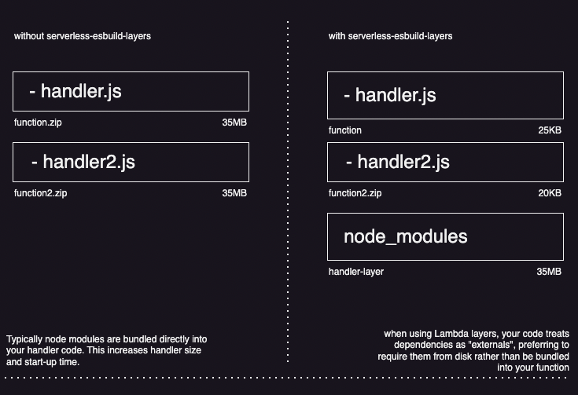

# serverless-esbuild-layers

[](https://codeclimate.com/github/beforeyoubid/serverless-esbuild-layers/test_coverage) [](https://codeclimate.com/github/beforeyoubid/serverless-esbuild-layers/maintainability)

Plugin for the [Serverless framework][serverless] that allows you to leverage Lambda layers to separate your node modules into layers attached to relevant functions.

This helps to keep the overall function size down.

This library is designed to be used in conjuction with [serverless-esbuild][serverless-esbuild] to build your code.

If you are using [serverless-webpack][serverless-webpack], you can try [serverless-webpack-layers][serverless-webpack-layers] to achieve this functionality.



## Installation

```sh
yarn add --dev serverless-esbuild-layers serverless-esbuild esbuild-node-externals
npm install --save-dev serverless-esbuild-layers serverless-esbuild esbuild-node-externals
pnpm install --dev serverless-esbuild-layers serverless-esbuild esbuild-node-externals
```

### Setup
Once installed, you need to add this to your serverless plugins:

```yaml
plugins:
  - serverless-esbuild
  - serverless-esbuild-layers
```

You also need to configure `serverless-esbuild` to externalise all node modules:

```yaml
custom:
  esbuild:
    plugins: esbuild-plugins.js
    exclude:
      - '*'
```

the [serverless-esbuild][esbuild-plugins] library supports custom plugins to configure esbuild. In order to leverage this library, you need to use [esbuild-node-externals][esbuild-node-externals] to externalise all node modules

```js
const { nodeExternalsPlugin } = require('esbuild-node-externals');

module.exports = [nodeExternalsPlugin()];
```

### Adding layers

Once the plugin is configured in your serverless file, you need to add Layer definitions to your serverless file:

```yaml
layers:
  lib:
    path: '.serverless'
    name: my-modules
    description: node_modules
    compatibleRuntimes:
      - nodejs14.x
```

Then you can reference the relevant layers in each function (the ref should match `NameLambdaLayer` where name is the key of your layer with the first character uppercase)
```yaml
functions:
  test:
    handler: handler.default
    layers:
      - { Ref: LibLambdaLayer }
```

If you have multiple functions, it's recommended to add different layers depending on node module overlap. This library will identify which modules are needed by all the functions attached to each layer.

## Config

This library can be configured by adding options into your serverless file:

```yaml
custom:
  esbuild-layers:
    packager: 'auto' # can be specified as 'npm' | 'yarn' | 'pnpm';
    forceExclude:
      - some-library
    forceInclude:
      - some-other-library
```

### Package.json pathing

If using a monorepo, you may need to specify a different package.json file. You can do so by using the `packageJsonPath` config variable like so:

```yaml
custom:
  esbuild-layers:
    packageJsonPath: ../
```

[serverless]: https://www.serverless.com/
[serverless-esbuild]: https://github.com/floydspace/serverless-esbuild
[serverless-webpack]: https://github.com/serverless-heaven/serverless-webpack
[serverless-webpack-layers]: https://github.com/beforeyoubid/serverless-webpack-layers
[esbuild-plugins]: https://github.com/floydspace/serverless-esbuild#esbuild-plugins
[esbuild-node-externals]: https://github.com/pradel/esbuild-node-externals